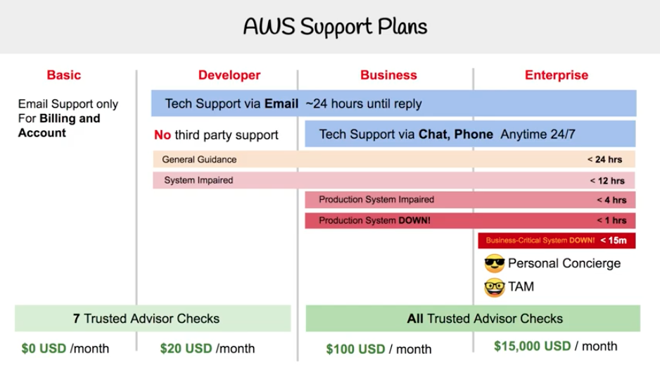
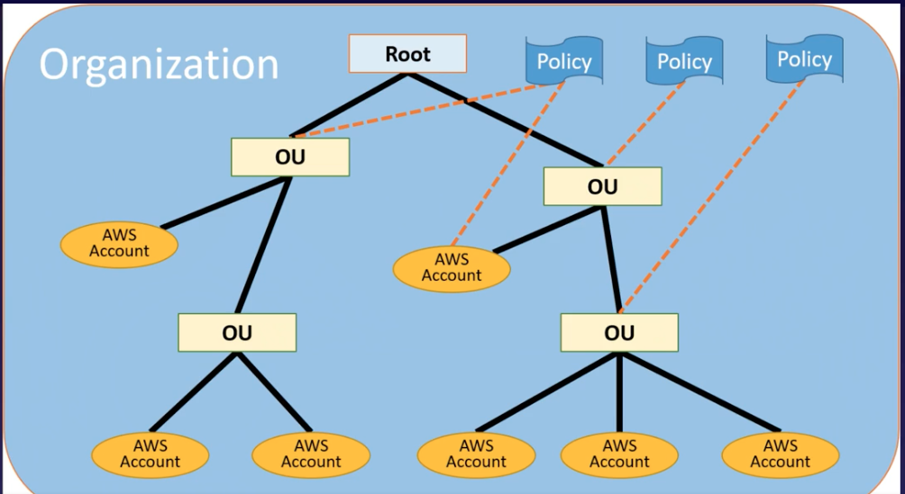
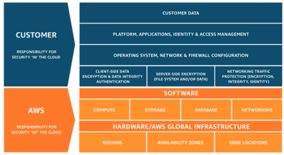

# [Cloud Practitioner](https://aws.amazon.com/certification/certified-cloud-practitioner/)

The intention of this document is to guide you through all topics covered by
the AWS Cloud Practitioner certification. So, you can focus on things that really
matter for the exam.

## What do you need to know to pass the Certified Cloud Practitioner Exam?
- AWS Global Infrastructure
- Compute
- Storage
- Databases
- Security, Identity and Compliance
- AWS Cost Management
- **Advantages of the Cloud**:
    - Go global in minutes
    - Stop spending money running and maintaining data centers
    - Increase speed and agility
    - Stop guessing about capacity
    - Benefit from massive economies of scale
    - Trade capital expense for variable expense
    
## AWS Cloud Certified Practitioner Video Series
Check out this video series from Exam Pro on YouTube that covers all exam topics:
[AWS Certified Cloud Practitioner Youtube Series](https://www.youtube.com/watch?v=B4kl23udOKo&list=PLBfufR7vyJJ4fOplWPOtYqRyQ6YPMsBsF)

## Introduction to AWS Cloud
- [AWS-Overview.pdf](https://d0.awsstatic.com/whitepapers/aws-overview.pdf)
- Cloud Computing
    - On demand delivery of resources and applications over the Internet
- Use services at your own pace
- Resize your resources when necessary
- AWS data centers spreaded across the globe
    - Cheaper than having your own data centers close to where all your customers are located
- AWS provides elastic infrastructure
    - Scale up and dow according to your needs
- 3 different ways to use AWS:
    - AWS Management Console (GUI)
    - AWS CLI 
        - Access to services via command line
    - AWS SDK
        - Ability to use AWS using programming languages such as Python, Java, Node.js, and Go
- **Golden Images**: Certain AWS resource types, such as EC2 instances, RDS DB instances and EBS
 volumes can be launched from a golden image, which is a snapshot of a particular state of that resource
 (faster start times and removes dependencies to config services when compared to bootstrapping)

### AWS Global Infrastructure
- https://aws.amazon.com/about-aws/global-infrastructure/
- Region: Composed of two or more availability zones
    - Not all services are available in all regions
- Availability Zone = data center
    - Physically and logically separated
- Edge Location
    - Endpoints for caching location (CDN)
- Fault Tolerance
    - System remains operational even if some components of that system fail
- High Availability
    - Ensures your system is always functioning and accessible
    - Max up time without manual intervention
- Security
    - Monitors IT resources continuously
    - Services meet the strictest requirements
    
### Cloud Concepts
- [AWS_Cloud_Best_Practices.pdf](https://d1.awsstatic.com/whitepapers/AWS_Cloud_Best_Practices.pdf)

#### Design Patterns
- Loose Coupling
- Scalability
- High Availability

##### Scalability 
Systems that are expected to grow over time need to be built on top of a scalable architecture. 
Such an architecture can support growth in users, traffic, or data size with no drop-in performance.

- **Scaling Vertically**: increase in the specifications of an individual resource (ex: resize instance type)
- **Scaling Horizontally**: increase in the number of resources (ex: add more instances to support app load)

## AWS Services

### S3
- [FAQs](https://aws.amazon.com/s3/faqs/)
- Fully managed storage service
- Unlimited number of objects
- Files can be from 0B to 5TB stored in Buckets
- Buckets have unique name globally
- S3 can be used to host static websites
- Objects consist of
    - **Key**: name of the object (usually defined as a file path)
    - **Value**: actual data
    - Version ID
    - Metadata
    - Sub-resources: ACLs and Torrent
- Data Consistency
    - **Read after write** for PUTS of new objects
    - **Eventual consistency** for overwrite PUTS and DELETES
- Access data anywhere:
    - AWS Console
    - CLI
    - SDKs
    - Direct Access to the bucket itself
        - URL-based access
        - https://<BUCKET_NAME>/<REGION_SPECIFIC_ENDPOINT>/<OBJECT_KEY>

#### S3 Storage Classes
- S3 Standard
    - 
- S3 Infrequently Accessed
- S3 One Zone Infrequently Accessed
- S3 Glacier
    - Retrieval time of 1-5 minutes
- S3 Glacier Deep Archive
    - Retrieval time of 12 hours
    - Lowest cost storage option in AWS
- S3 Intelligent Tiering
    
#### S3 Pricing
- In S3, AWS charges you for:
    - *Storage*: Number and size of objects
    - *Requests*: different rates for GET requests
    - *Storage Management*: standard, standard-infrequent access, etc
    - *Data Transfer*: amount of data transferred out of S3
    - *Transfer Acceleration*: 
        - Objects are uploaded to Edge locations and then they are transferred over AWS backbone to the actual bucket

#### Restricting Bucket Access
- IAM Policies to Users & Groups
    - Applies to individual users and groups
- Bucket Policies
    - Applies across the whole bucket
- ACLs
    - Applies to individual files
    - You can attach S3 ACLs to individual objects within a bucket to manage permissions for those objects
    - As a general rule, AWS recommends using S3 bucket policies or IAM policies for access control
        - S3 ACLs is a legacy access control mechanism that predates IAM
    

### CloudFront
- Content Deliver Network (CDN)
- Content will be cached on Edge Locations
    - You can read (CDN) and write (transfer acceleration) to Edge Locations
- Origin
    - This is the origin of all files that the CDN will distribute (S3, EC2, ALB, R53)
- Distribution
    - Name of the CDN
    - Consists of a collection of Edge Locations
    - Types
        - **Web Distribution**:  Static-asset caching
        - **RTMP**: Live and on-demand streaming
- Objects are cached for the TTL
    - Cache can be cleared but you will be charged
- Used to deliver both static and dynamic content
- Content NOT necessarily has to be in AWS

#### CloudFront Pricing
- Princing varies across geographic regions
- Pricing based on: requests and data transfer out

### EC2
- EC2 - Elastic Compute Cloud
    - Increase or decrease the # of instances your app needs
- Pay as you go
- Global hosting across AWS regions

#### EC2 Pricing
- Resources incur charges only when running
- Instance configuration
    - Pricing varies: region, OS, instance type, instance size
- On-demand instance
    - Pay for compute capacity by the hour and second (min of 60s)
- Reserved Instance
    - Capacity reservation with significant discount on the hourly charge (1-3-year contract)
    - Useful for applications with predictable usage
- [Spot Instances](https://docs.aws.amazon.com/AWSEC2/latest/UserGuide/how-spot-instances-work.html)
    - If your maximum price exceeds the current Spot price and capacity is available, your request is fulfilled 
        immediately
    - If the Spot price exceeds your maximum price, when the demand for Spot Instances rises, or when the supply 
        of Spot Instances decreases, EC2 can stop your instances
    - Cost-effective choice if you can have flexible start and end times
- Dedicated Instances
    - Physical EC2 servers dedicated for your use

### EBS
- Storage unit of EC2 instances
    - Can be HD or SSD devices
- Replicated in the same AZ
- Volumes are located in AZs and can only be attached to EC2 in the same AZ
- If a volume is detached from an instance, it'll stay in the *available* state
- Snapshots
    - You can recreate volumes from snapshots
- Encrypted Volumes
    - Encrypted in transit (inside AWS data center)

#### EBS Pricing
- Pay for GB per month
- Types
   - General purpose: included in price
   - Provisioned IOPS: charged by the amount you provision in IOPS
   - Magnetic: charged by the number of requests
- Snapshots
   - Added cost per GB per month of data stored
   - Inbound data transfer is free
   - Outbound data transfer are tiered

### VPC
- Private networking within AWS cloud
- Allows complete control of network configuration
- Offers several layers of security controls
    - Allow and deny specific internet and internal traffic
- Other AWS services that can be deployed into a VPC
    - Those services will inherent security built into network

#### VPC Features
- Builds upon Regions and AZs
    - Multiple VPCs per account
- Subnets
    - Divide a VPC
- Route Tables
    - Control traffic going out of the subnets
- Internet Gateway
    - Allows access to the internet from the VPC
- NAT gateway
    - Allows private subnet resources to access Internet
- Network Access Control List (NACL)
    - Control access to subnets; stateless

#### VPC Security Groups
- Filters traffic to your instances and other resources in a VPC via SG rules
- By default, all inbound traffic is denied and all outbound traffic is allowed

### Load Balancer
- 3 types: Application, Network and Classic
- ALB
    - Enhanced features when compared with Classic LB
        - Path and host-based routing
        - WAF integration
        - Dynamic Ports
        - Deletion, protection and request tracing
        - Native IPv6 Support
        - HTTP/2 and WebSockets support
    - Requires at least 2 AZs
    - Use Case
        - Ability to use containers for your microservices
        - ALBs allow you to distribuite traffic across a set of instances based on the request path
    - Key Terms
        - Listeners
            - Process that checks for connection requests using the protocol and port that you configure
        - Targets
            - Destination for target based on the listener rules
            - Targets can be member of multiple target groups
        - Target Groups
            - Routes requests to one or more registered targets using the protocol and port specified
    - How to create an ALB
        - Configure Load Balancer
            - name, schema (internet-facing or not), listeners - protocols and ports, VPC and AZs, and tags 
        - Configure Security Settings
        - Configure Security Groups
        - Configure Routing
            - Allows you to configure routing rules for the backend destination of the ALB
            - Where you define a target group and health check
        - Register Targets
            - Tell the load balancer what instance you want that port to be hit

### Auto Scaling
- Ensure that you have the correct number of EC2 instances to handle the load of your application
- Adjust capacity as needed
- Scaling Out and Scaling In
    - Out: add more boxes
    - In: terminate instances
- How do you Auto Scale?
    - Need a Launch Configuration
        - **What** will be launched? 
        - AMI, instance type, SGs, roles
    - Need an Auto Scaling Group
        - **Where** will it be deployed? 
        - VPC, ALB, max and minimum # of instances, and capacity
    - Auto Scaling Policy
        - **When** to launch or terminate instances
        - Scheduled, on-demand, Scale-out policy and scale-in policy
- CloudWatch Alarm for Auto Scaling
    - CPU utilization for a specified period of time
    - CPU is >= 80% for 10 minutes, CloudWatch then triggers auto scaling automatically to scale out the app

### Route 53
- Global, high available DNS service
- Offers different resolution strategies:
    - Geo-location
    - Failover
    - Weighted Round Robin
    - Latency-based
    - Multi-value answer

### RDS
- Cost-efficient and resizable capacity for your database: SQLServer, MySQL, PSQL,
- Multi-AZ deployments
    - Ideal for high availability
    - If master in a zone fails over to the other instance running on another zone
- Read Replicas
- Manages
    - OS installation and patching
    - DB SW installation and patching
    - DB backups
    - High Availability
    - Scaling
    - Server Maintenance (zero downtime) 

#### RDS Pricing
- Resources incur charges when running
- Charges vary from engine, size, and memory class
- Purchase Types:
    - On-demand: charged by the hour
    - Reserved: upfront payment (discount)
- No additional for backup storage if DB instance is running
- Deployment types:
    - Single AZ
    - Multi-AZ

### AWS Lambda
- AWS managed service that allows you to run code without worring about any servers
- Auto-scaling, monitoring and logging
- Can respond to HTTP requests
- Can be triggered by events or other AWS Lambda functions

### AWS Elastic Beanstalk
- Deploy and manage apps in the cloud without worrying about the infrastructure
- Upload your code and Elastic Beanstalk automatically handles the of capacity provisioning,
  load balancing, scaling and app health monitoring

### SNS
- Pub/sub messaging
- Mobile Notification

### CloudWatch
- Monitoring Performance
    - Monitor events every 5 minutes by default (detailed monitoring: 1 min intervals)
- Can create alarms which trigger notifications
- Metrics, Alarms and Actions
    - CW Watches a single metric (e.g. CPU utilization > 60% for 5+ minutes)
    - CW Performs one or more actions
        - Based on the value of the metric relative to a threshold over a # of time periods
    - An action can be
        - EC2 action: start, stop or terminate instances
        - Auto Scaling action
        - Notification
- CW logs
    - Monitor and troubleshoot systems and apps using existing log files
    - Monitor logs from EC2 in real-time
    - Monitor CloudTrail logged events
    - Archive log data (S3)
- CW Dashboards
    - Customizable home pages in CW console to monitor your resources in a single view
    - Customized view of the metrics and alarms for your AWS resources

### CloudFormation
- Automate resource provisioning
- Create, update and delete resources in stacks (sets of resources)
- Template File -> CloudFormation -> Stack
    - Template
        - Resources to provision
        - Text file (JSON or YAML)
        - Infra as code
    - Stack
        - Unit of deployment
        - Where resources are generated
        - CRUD

### AWS Services Deployed On Premise
- Snowball
- Snowball Edge (allows lambda deployments)
- Storage Gateway
    - Caching files in your data center and replicate them to S3
- Code Deploy
    - Used to deploy apps on premises
- OpsWorks
    - Deploy app code to the cloud and on premise using Chef
- IoT Greengrass

### AWS Systems Manager
- Manage fleets of EC2 instances
- Can be both inside AWS and on premise
- Run Command is used to install, patch and uninstall software
- Integrates with CloudWatch to give you a dashboard

## Billing and Pricing
- [AWS Pricing Overview](https://d0.awsstatic.com/whitepapers/aws_pricing_overview.pdf)
- [The Total Cost of (Non) Ownership of
   Web Applications in the Cloud](https://media.amazonwebservices.com/AWS_TCO_Web_Applications.pdf)

### Pricing Fundamentals
- Compute
    - Pay only for the resources you use
    - If you used 1h of AWS resources, you pay for 1h of that resource
- Storage
    - AWS charges you per GB
- Outbound Data Transfer
    - You are charged per GB transferred **out** of AWS infrastructure 

### Different Pricing Models
- Capex vs Opex
- **Capex**: Capital Expenditure
    - Pay up front
    - Fixed, sunk cost
- **Opex**: Operational Expenditure
    - Pay for what you use

### Pricing Policies
- Pay as you go 
- Pay less when you reserve
- Pay even less per unit by using more
- Pay even less as AWS grows
- Custom prices

### RDS Pricing
- Clock Hours of Server Times (how long RDS instance run)
- DB Characteristics: SQL Server, MySQL, PSQL
- DB Purchase Type: how large the DB is
- Number of instances
- Provisioned Storage
- Additional Storage
- Requests
- Deployment Type
- Data Transfer

### DynamoDB Pricing
- Provisioned Throughput Write
- Provisioned Throughput Read
- Indexed data storage: how much data you're storing in dynamo

### CloudFront Pricing
- Traffic distribution
- Number of requests
- Data transferred out

### AWS Budgets vs Cost Explorer
- **Budgets**: Predict costs BEFORE they are incurred
- **Cost Explorer**: explore costs AFTER they are incurred

### [Support Plans](https://aws.amazon.com/premiumsupport/plans/)

### Resource Groups and Tagging
- Tags
    - KV pairs attached to AWS resources
    - Metadata
- Resource Groups
    - Make it easy to group your resources using the tags that are assigned to them
    - You can group resources that share one or more tags
    - Apply automation to resources with specific tags (for example, stop all instances)
    - Resource Groups in combination with AWS Systems manager allow you to control and execute automation against
    an entire fleet of EC2 instances
- Tag Editor
    - Global service that allows you to discover resources with tags and add additional tags to them as well

### AWS Organizations & Consolidated Billing
- AWS Organizations
    - Paying account should be used for billing purposes (resources should not be deployed)
    - 20 linked accounts (soft limit)
    - Root account cannot link to another root account
    - 
- Consolidated Billing
    - Allows you to get volume discounts on all your accounts (all resources are combined)
    - Unused reserved EC2 instances are applied across the group
    - CloudTrail is on a per account and per region basis, but can be aggregated into a single bucket belonging to the paying account
    
### AWS Quick Start & AWS Landing Zone
- AWS Quick Start
    - Deploying AWS environments quickly using CloudFormation templates built by Solutions Architects
- AWS Landing Zone
    - Set up a secure, multi-account AWS environment based on AWS best practices
    - Starts with 4 different accounts
    
### AWS Calculators
- [Simple Monthly Calculator](https://calculator.s3.amazonaws.com/index.html)
    - Used to calculate running costs on AWS on a per month basis
- [AWS Total Cost of Ownership](https://aws.amazon.com/tco-calculator/)
    - Used to compare the costs of running your infrastructure on premise vs in AWS
   
    
### Free Services
- VPC
- Elastic Beanstalk
- CloudFormation
- IAM
- Auto Scaling
- Opsworks
- Consolidated Billing

## Security in the Cloud

### AWS Compliance & AWS Artifact
- AWS Compliance
    - Several certifications: ISO 9001, ISO 27000
- AWS Artifact
    - Retrieve compliance reports

### Shared Responsibility Model
[Shared Responsibility Model](https://aws.amazon.com/compliance/shared-responsibility-model/)

### AWS WAF & AWS Shield
- WAF: Web Application Firewall
    - Operates at layer 7
    - Prevents SQL injection, Cross-site scripting or any attack on the app layer
- Shield
    - Prevents DDoS attacks
    - It turned on automatically on all AWS accounts
    - Advanced Mode: USD 3000/month
        - You do not have to pay to increased bills on network traffic
        - Offers automated application layer monitoring

### AWS Inspector vs AWS Trusted Advisor vs CloudTrail
- AWS Inspector
    - Inspects EC2 instances for vulnerabilities
- AWS Trusted Advisor
    - Inspects your AWS account as a whole (not only EC2)
    - In addition to security checks, it also does Cost Optimization, Performance and Fault Tolerance
- CloudTrail
    - Inspects AWS console actions and API calls
    - Allows you to identify which users and accounts called AWS, source IP and date

### CloudWatch vs AWS Config
- CloudWatch
    - Monitors performance
    - Host level metrics: CPU, Network, Disk, and Status Check
- AWS Config
    - Detailed view of the configuration of AWS resources in your AWS account

### Athena Vs Macie
- Athena
    - Interactive query service
    - Allows you to query data located in S3 using SQL
    - Serverless
    - Analyse AWS cost and usage reports
- Macie
    - Uses AI to analyze data in S3
    - Helps identify sensitive data in S3 objects such as PII (Personally Identifiable Information)
    - Includes dashboards, reports and alerting
    - Great for PCI-DSS compliance and preventing ID theft
    

### IAM
- Global
- Group
    - Place to store users
    - Users will inherit all permissions that the group has
- To set the permissions in a group you need to apply a policy to that group
    - Policies consist of JSON
- Root Account
    - Email address used to set up your AWS account
- Role
    - Changes take place immediately

#### Identity x Entity x Principal
- **Identities**: IAM resource objects that are used to identify and group
    - These include users, groups, and roles
- **Entities**: IAM resource objects that AWS uses for authentication
    - These include IAM users, federated users, and assumed IAM roles
- **Principal**: person or application that uses the AWS account root user, an IAM user, or an IAM role to sign in and make requests to AWS

### AWS Systems Manager
- Gives administrators secure access to EC2 instances
- It allows them to create command documents and run them on any desired set of EC2 instances, with support for both Linux and Microsoft Windows
- The commands are run asynchronously, with output captured for review

### The AWS Well-Architected Framework
- 5 pillars and design principles
    - Security
    - Reliability
    - Performance Efficiency
    - Cost Optmization
    - Operational Excellence
- Security Pillar
    - IAM
        - Ensure authorized and authenticated users are able to access your resources
    - Detective Controls
        - Identity potential security incident
    - Infrastructure protection
        - Systems and services are protected against unintended and unauthorized access
    - Data Protection
        - Encryption, backup, replication and recovery
    - Incident response
        - Response and mitigate any potential security incidents
    - Design Principles
        - Implement securities at all layers
        - Enable traceability: logging and auditing for all actions
        - Apply principle of least privilege
        - Focus on securing your system: shared responsibility model
        - Automate
- Reliability Pillar
    - Recover from failures
    - Apply best practices on:
        - Foundation
        - Change Mgmt
        - Failure Mgmt
    - Anticipate, respond and prevent failures
    - Design Principles
        - Test recovery procedures
        - Automatically recover
        - Scale Horizontally
        - Stop guessing capacity 
            - You can monitor demand and system utilization
            - Automation the addition or removal of resources
        - Manage change in automation
- Performance Efficiency Pillar
    - Select customizable solutions
    - Review to continually innovate
    - Monitor services
    - Consider the trade-offs
    - Design Principles
        - Democratize advance technologies: consume them as a service
        - Go global in minutes
        - Serverless
        - Experiment more often
        - Have mechanical sympathy
- Cost Optimization Pillar
    - Use cost-effective resources: Build and operation cost-aware systems
    - Matching supply with demand: elasticity of resouces (auto-scale)
    - Increase expenditure awareness: plan future changes
    - Optimize over time: mesure, monitor and apply changes based on the data you collected from your resources
    - Design Principles
        - Adopt a consumption model: pay for what you use
        - Measure overall efficiency: measure the costs of your infra
        - Reduce spending on data center operations
        - Analyze and attribute expenditure: simpler and easier to accurately identify the usage and cost of systems
        - Use managed services
    - Operational Excellence Pillar
        - Manage and automate changes
        - Respond to events
        - Define the standards

### Fault Tolerance and High Availability Architectures
- Fault Tolerance
    - Ability for a system to remain function after a failure
    - Service Tools
        - SQS: distributed messaging system
        - S3: highly durable data storage
        - RDS: setup and scale relational DBs (automated backups, snaphots and multi-zone deployments)
- High Availability
    - Systems are generally up and running
    - On AWS:
        - Multiple Servers
        - Zones
        - Regions
        - Fault-tolerant Services
    - Service Tools
        - ELBs
            - Distributes incoming traffic among your instances
            - Can be customized
        - Elastic IP
            - Static IP addresses
            - Designed for dynamic cloud computing
        - Route 53
            - Authorative DNS service
            - Supports:
                - Simple routing
                - Latency-based routing
                - Health Checks
                - DNS failovers
                - Geolocation routing
        - Auto Scaling
            - Terminates and launches instances on demand automatically
            - Scale in or out depending on your policies
        - CloudWatch
            - Distributed Statistics gathering system
            - Tracks metrics of your resources
