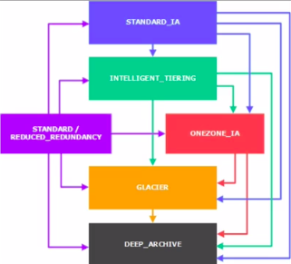
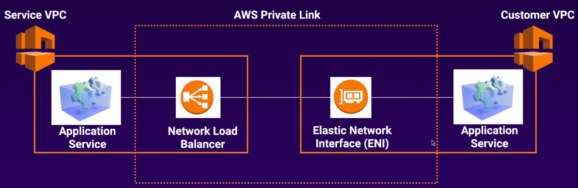
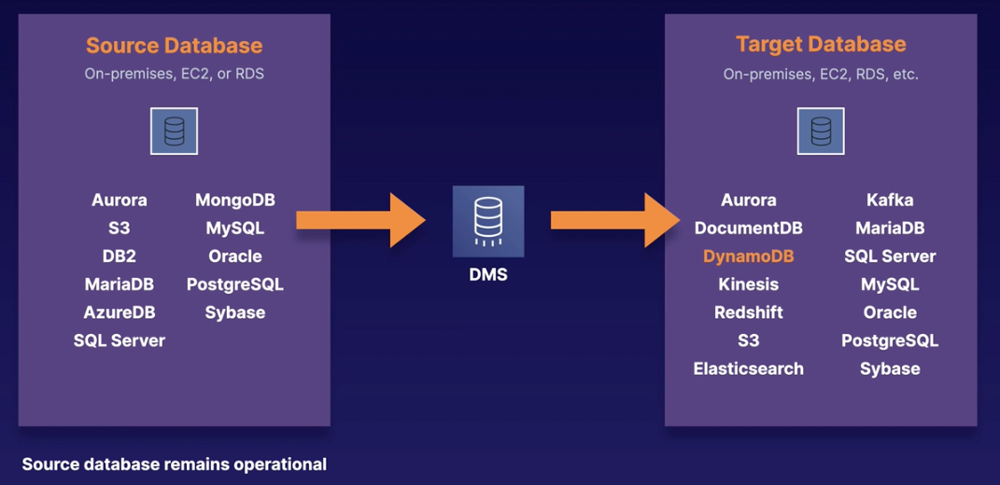

# AWS Solutions Architect Associate (SAA-C02)

## Exam Tips
- [Do Your Homework: 7 AWS Certified Solutions Architect Exam Tips (Toptal)](https://www.toptal.com/aws-cloud-engineers/aws-certified-solutions-architect-exam-tips?utm_campaign=Toptal%20Engineering%20Blog&utm_source=hs_email&utm_medium=email&utm_content=82924000&_hsenc=p2ANqtz-9e8pBmq7n-oAcI1KJysb6eOjefvmT1pyAikVEgPso5N_p9HFPVsj2xKEao5RfwkluPNyub0hFcKkHCTQAsbC_TUsD0zQ&_hsmi=82924000)
- [SAA-C02 Exam Tips AWS Certified Solutions Architect Associate](https://hakeem-me.cdn.ampproject.org/c/s/hakeem.me/2020/09/25/saa-c02-exam-tips-aws-certified-solutions-architect-associate/amp/)

## Exam Guides
- [Associate SAA-C02 Exam Guide - NEW VERSION](https://d1.awsstatic.com/training-and-certification/docs-sa-assoc/AWS-Certified-Solutions-Architect-Associate_Exam-Guide.pdf)
- [Passing the AWS Certified Solutions Architect Associate (SAA-C02) Exam](https://cantrill.io/2020/05/24/Passing-the-AWS-certified-solutions-architect-associate-saa-c02-certification.html)
- [AWS SAA C02 Course Exam Notes](https://github.com/alozano-77/AWS-SAA-C02-Course)
- [AWS Whitepapers](https://aws.amazon.com/whitepapers/)
- [FreeCodeCamp YouTube Series](https://www.youtube.com/watch?v=Ia-UEYYR44s)

## 10,000 Foot Overview
- [AWS Global Infrastructure](https://aws.amazon.com/about-aws/global-infrastructure/)
    - Availability Zone =  data center
    - Region: Composed of two or more availability zones
    - Edge Location: endpoints for caching location (CDN)
- Support Plan
    - Basic (Free), Developer and Business
    - Enterprise: if you need an AWS TAM

## IAM - Identity and Access Management
- [FAQs](https://aws.amazon.com/iam/faqs/)
- Manage users, and their level of access to AWS
- Centralized control
    - IAM is global (not tied to specific regions)
- Granular Permissions
- Identify Federation (Facebook, LinkedIn, etc)
- [MFA](https://aws.amazon.com/iam/features/mfa/)
- You can implement your own password rotation policy
- Groups are a collection of Users
- Policy: documents in JSON used to grant permissions
- [IAM Role](https://aws.amazon.com/iam/faqs/#IAM_role_management): a way to allow a resource the ability to talk to another resource
- Root Account: account used when 1st setup your AWS account
- IAM is a feature of your AWS account offered at no additional charge
    - You will be charged only for use of other AWS services by your users
- [IAM Best Practices](http://docs.aws.amazon.com/IAM/latest/UserGuide/IAMBestPractices.html)
- Princing
    - IAM is a feature of your AWS account offered at no additional charge
    - You will be charged only for the use of other AWS services by your users
    
### AWS Directory Service
- AD Compatible
    - Managed Microsoft AD
    - AD Connector
    - Simple AD
- Not AD Compatible
    - Cloud Directory
    - Cognito user pools

### IAM Policies
- It contains Effect/Action/Resource
- Identity vs Resource Policies
    - Identity Policies define permissions for users and groups
    - Resource Policies define permissions for AWS services
- Not explicitly allowed = implicitly denied
- Explicit deny >>> everything else
- Only attached policies have effect
- AWS joins multiple policies when evaluating them
- AWS-manged vs customer-managed policies
- Permission Boundaries
    - Prevent privilege escalation or unnecessarily broad permissions
    - Controls maximum permissions an IAM policy can grant
    
### AWS Resource Access Manager (RAM)
- Allows resource sharing between accounts

### AWS SSO
- Centrally manage access to AWS accounts and business apps
- SAML 2.0

## Simple Queue Service - SQS
- SQS is pull-based, not pushed-based: you need to have an EC2 instance pulling the messages out of the queue
- Queue types:
    - Default: does not guarantee delivery order (no limit of requests per second)
    - FIFO: first message in the queue is the first one to come out (limite of 300 requests per second)
- Messages are 256KB in size
- Messages are delivered **at least** once
- Retention Period
    - Messages can be kept in the queue from 1 minute to 14 days (default value is 4 days)
- **Visibility Timeout**:
    - Amout of time that the message is invisible in the queue *after* a reader picks up that message
    - If message is processed before the visibility timeout expires, then the message is deleted from the queue
    - If message is not processed within the visibility timeout period, then the message will become visible again and another reader will process it -- *this could result in the same message being delivered twice*

### [Long Polling vs Short Polling](https://docs.aws.amazon.com/AWSSimpleQueueService/latest/SQSDeveloperGuide/sqs-short-and-long-polling.html)
- With **short polling**, the `ReceiveMessage` request queries only a subset of the servers (based on a weighted random distribution) to find messages that are available to include in the response
    - Amazon SQS sends the response right away, even if the query found no messages
- **Short polling** occurs when the `WaitTimeSeconds` parameter of a `ReceiveMessage` request is set to 0 in one of two ways:
    - The `ReceiveMessage` call sets `WaitTimeSeconds` to 0
    - The `ReceiveMessage` call doesn't set `WaitTimeSeconds`, but the queue attribute `ReceiveMessageWaitTimeSeconds` is set to 0.
- With **long polling**, the `ReceiveMessage` request queries all of the servers for messages. Amazon SQS sends a response after it collects at least one available message, up to the maximum number of messages specified in the request
    - Amazon SQS sends an empty response only if the polling wait time expires

## S3
- 
- [FAQs](https://aws.amazon.com/s3/faqs/)

### S3 Basics
- Object-based storage
- Files are stored in buckets
    - 0 < file size <= 5 TB
    - [Multipart upload](https://docs.aws.amazon.com/AmazonS3/latest/dev/UploadingObjects.html)
        - "Your proposed upload exceeds the maximum allowed object size." error: design your application to use the Multipart Upload API for all objects
- Objects
    - Key: name
    - Value: sequence of bytes
    - Version ID: important if bucket has versioning enabled
        - Bucket + Key + Version ID = uniquely identify an object
    - Metadata: data about your object
    - Subresources (ex: ACLs)
- S3 supports 3500 PUTs per second
    - More details in https://docs.aws.amazon.com/AmazonS3/latest/dev/request-rate-perf-considerations.html
- Namespace
    - Universal namespace (like DNS)
    - Can be accessed at:
        - http://<bucket>.s3.amazonaws.com
        - http://<bucket>.s3-<region>.amazonaws.com

### S3 Pricing
- Size
    - More GB, more $$$
- Requests
    - More requests to files, more $$$
- Storage Management
    - != storage classes have != pricing
- Data Transfer
    - More file moves, more $$$
- Data Transfer Acceleration
    - Transfer Accelearation allows you to transfer files to the closest AWS Edge location, then use AWS backbone infrastructure to transfer those files to the actual bucket
- Cross-Region Replication

### S3 Data Consistency
- Read after write for PUTS
    - *If you upload a new file, you're able to read it immediately*
- Eventual consistency for overwrite PUTS and DELETES
    - *If you upload/delete an existing file and try to read it immediately, you may get its older version*
    
### S3 Object Storage Classes
- Frequently Accessed Objects
    - Standard (default)
        - Hily durable, highly available
        - $0.023 per GB
        - 99.99% availability
    - [Reduced Redundancy Storage (RRS)](https://aws.amazon.com/s3/reduced-redundancy/) *deprecated*
        - Like Standard but with less durability because data is not replicated as many times
        - $0.004 per GB
- Infrequently Accessed Objects (IA)
    - Standard IA
        - Hihly durable, highly available: data accessed less frequently but still requires fast access
        - $0.0125 per GB
        - 99.9% availability
    - One Zone (IA)
        - Highly durable
        - Do not require multiple AZs resilience
        - $0.01 per GB
        - 99.5% availability
- Unknown Access Patterns
    - Intelligent Tiering
        - Automatically moves data to cheaper storage using Machine Learning (standard -> standard IA)
        - Not charged for retrievals
        - Perfect for long-lived data that has unpredictable access patterns
- Rarely Accessed Objects        
    - Glacier
        - [FAQs](https://aws.amazon.com/glacier/faqs/)
        - Highly durable and low-cost storage
        - Retrieval time adjustable from minutes to hours
        - Minimum billable storage time of 90 days
        - [Data Retrievals](https://aws.amazon.com/glacier/faqs/?nc=sn&loc=6#Data_retrievals)
            - Cost of retrieval of information from Glacier can go up dependent on how quickly you require the data and how much data is to be retrieved
            - **Expedited retrievals** allow you to quickly access your data stored in the S3 Glacier storage class when occasional urgent requests for a subset of archives are required, but at the highest cost
            - **Standard retrievals** allow you to access any of your archived objects within several hours, this is faster than bulk (averaging around 12 hours) but more expensive
            - **Bulk retrievals** are the lowest-cost retrieval option in Amazon S3 Glacier, enabling you to retrieve large amounts, even petabytes, of data inexpensively
    - Deep Archive
        - Highly durable 
        - Cheapest storage solution in AWS
        - Retrieval time: 12 hours
        - Minimum billable storage time of 180 days

#### S3 Lifecycle Management
- Lifecycle Policies allow objects to transition between storage classes
    - Transition Rules: define when objects move to another storage class
    - Expiration Rules: define when objects are deleted
    - 
- Can be used with versioning
- Can be applied to current and previous versions

### S3 Security

#### ACLs
- ACLs are resource policies used to grant access on both buckets and objects
- Each bucket and object has an ACL attached to it as sub-resource that defines permissions
- The default ACL grants the resource own full control over the object
- Features:
    - Used only to grant permissions to AWS accounts and pre-defined groups
    - Only grant read and write permissions (no conditional nor deny permissions)

#### Bucket & User Policies
- Bucket and user policies are policies (defined in JSON) that can be used to grant access to both buckets and objects
    - User Policies are user based and are managed in IAM
- Not applied by default
- Can grant very fine grained permissions
- Can explicitly deny access
- Can grant conditional permissions
- Max size is 20KB
- Policy contains the following:
    - Conditions
        - Optional policy elements that allow you to specify conditions for then the policy is in place
        - Ex: allow users to put objects in buckets only if encryption is enabled 
    - Effect: either *allow* or *deny*
    - Action: list of permissions to allow or deny
    - Resource: bucket or object name
    
#### S3 Data Encryption
- S3 encrypts data before it's written to disk
- Encryption means refers to the protection of data in transit and at rest
- Encryption In Transit: HTTPS
- Encryption At rest:
    - SS3 (Server-side Encryption)
        - SS3-S3: s3-provided keys
        - SS3-KMS: kms-provided keys
        - SSE-C: customer-provided keys (key is uploaded via HTTPS with data, s3 uses that key to encrypt the data and then get rid of it)
    - Client-side Encryption
        - Customer Master Key
            - Data is encrypted before being uploaded to s3
        - KMS
            - KMS master key is used
            - Key is used to encryt the data on the client side
- 
#### S3 Versioning
- Keep multiple versions of the same object in the same bucket
    - Allows you to retrieve any version of any object ever stored in S3 (even if it is deleted)
- S3 stores all versions of an object (including all writes even if you delete the object)
- Once enabled cannot be disabled, only suspended
- It raises storage
    - Upload 1Gb-file 5x = 5 GB worth of storage
- You can change permissions of any object version
    - Old versions permissions *DO NOT* change if you change permissions on the latest version
    - *File A v1 is public, you upload a new version of it, becoming v2, then you change File A to be private, users will still be able to access File A v1*

### S3 Cross-Region Replication
*Async replication of objects between buckets in != regions*
- Versioning must be enabled on both Source and Destination buckets
- Existing files in the source bucket are not replicated automatically to destination
- All subsequent updated files are replicated automatically
- *DELETES* are not replicated (including the deletion of individual versions)

### S3 Cross-Account Access
- Can be granted via ACLs
    - With ACLs access can only be granted directly to AWS accounts and not to IAM users
    - With ACLs conditions cannot be enforced
- Can be granted via Bucket Policies
    - With Bucket policies access can be granted to IAM users in addition to the account
    - Conditions can be enforced
- Access to IAM users must by explicitly delegated
    - For both ACLs and Bucket Policies, permissions must be explicitly delegated to an IAM user in order for them to exercise their access

### S3 Query and Auditing (Athena x Macie)
- Athena
    - *Interactive query service*
    - Allows you to query data in S3 using SQL
    - Serverless
    - Commonly used to analyze logs in S3
    - [FAQs](https://aws.amazon.com/pt/athena/faqs/)
- Macie
    - *Security service*
    - Uses AI to analyze data in S3
    - Can analyze Cloud Trail
    
### S3 Object Lock & Glacier Vault Lock
- S3 Object Lock
    - Store objects using a Write Once, Read Many (WORM) model
    - Can be applied to individual objects or acc=ross the entire bucket
    - Two Modes:
        - **Governance Mode**: users cannot overwrite or delete an object version or alter lock settings (unless they have special permissions)
        - **Compliance Mode**: objects cannot be overwritten or deleted by **any** user (including root)
- S3 Glacier Vault Lock
    - Allows you to easily deploy and enforce compliance controls for S3 Glacier Vaults
    - You can specify controls such as WORM in a Vault Lock policy and lock the policy from future edits
    - Once locked, the policy cannot be changed
    
### S3 Performance
- 5,500 GET/HEAD requests per second per prefix
- 3,500 PUT/COPY/POST/DELETE requests per second per prefix
- Prefix: s3://mybucket/folder1/subfolder1/myfile.txt = folder1/subfolder1
- Better performance if reads are spread across different prefixes
    - For instance, 2 prefixes = 11,000 GET requests per second
- Bear in mind KMS limits
    - Always have to encrypt objects when writting them to the bucket
    - Always have to decrypt objects when reading them from the bucket
- Use multi-part uploads to increase performance when uploading files
    - Should be used to for files > 100MB (must be used for files > 5GB)
- Use s3-byte range fetches to increase performance when downloading files

### S3 Select & Glacier Select
- S3 Select
    - Used to retrieve only a portion of the data from an object
    - Get data by rows and columns using SQL
    - Save money on data transfer and increase speed
- 

### [Accessing content in S3](https://docs.aws.amazon.com/AmazonS3/latest/dev/UsingBucket.html#access-bucket-intro)
- There are 4 different URLs styles that it can be used to access content in S3
    - [The Virtual Hosted Style URL](https://docs.aws.amazon.com/AmazonS3/latest/dev/VirtualHosting.html#virtual-hosted-style-access)
    - [The Path-Style Access URL](https://docs.aws.amazon.com/AmazonS3/latest/dev/VirtualHosting.html#path-style-access)
    - [The Static web site URL](https://docs.aws.amazon.com/AmazonS3/latest/dev/WebsiteHosting.html)
    - [The Legacy Global Endpoint URL](https://aws.amazon.com/blogs/aws/amazon-s3-path-deprecation-plan-the-rest-of-the-story/)
- There are three options which can be used to secure access to files stored in S3:
    - Signed URLs and Signed Cookies are different ways to ensure that users attempting access to files in an S3 bucket can be authorised: One method generates URLs and the other generates special cookies but they both require the creation of an application and policy to generate and control these items
    - An Origin Access Identity on the other hand, is a virtual user identity that is used to give the CloudFront distribution permission to fetch a private object from an S3 bucket
    - Public S3 buckets should never be used unless you are using the bucket to host a public website and therefore this is an incorrect option
    - Further information: 
        - https://docs.aws.amazon.com/AmazonCloudFront/latest/DeveloperGuide/PrivateContent.html
        - https://docs.aws.amazon.com/AmazonCloudFront/latest/DeveloperGuide/private-content-signed-urls.html
        - https://docs.aws.amazon.com/AmazonCloudFront/latest/DeveloperGuide/private-content-signed-cookies.html-
        - https://docs.aws.amazon.com/AmazonCloudFront/latest/DeveloperGuide/private-content-restricting-access-to-s3.html

### CloudFront
- *Content Delivery Network (CDN)*
- Edge Location: where content will be cached (read and write)
- Origin: source of all files CDN will distribute (S3, EC2, ELB and R53)
- Distribuition: CDN given name, which consists of a collection of Edge Locations
- Web Distribuition: used for websites
- RTMP: media streaming
- Objects are cached for the life of TTL
- You can invalidate cache, but you're charged for it

### Storage Gateway
- NFS (File GTW): flat files stored in S3
- Volume GTW
    - Stored: entire dataset on site and backed up to S3 asynchronously
    - Cached: entire dataset on S3 and most frequently accessed data is cached on sit
- GTW Virtual Tape Library

### S3 FAQs
- [S3 FAQs](https://aws.amazon.com/s3/faqs/)
- [S3 Glacier FAQs](https://aws.amazon.com/glacier/faqs/)

## EC2
*Provides resizable compute capacity on the cloud*

- [FAQs](https://aws.amazon.com/ec2/faqs/#longer-ids)

### Pricing
- On demand
- Reserved
    - Predictable usage
    - Standard Reserved Instances
    - Convertible Reserved Instances: can change instance type (t2.medium -> m2.medium)
        - For more information, check out [Standard  vs. Convertible Offering Classes](https://docs.aws.amazon.com/whitepapers/latest/cost-optimization-reservation-models/standard-vs.-convertible-offering-classes.html)
    - Scheduled Reserved Instances: launched within specific time windows
- Spot
    - Flexible start and end times (if AWS stops the instance, you don't pay; if you stop it, you pay)
    - Spot instances save up to 90% of the cost of On-demand Instances
    - You can block Spot instances from terminating by using Spot Block
    - Spot Fleet
        - Collection of Spot Instances and, optionally, On-demand instances
- Dedicated Hosts

### Launching EC2 Instances
- Termination protection is turned off by default
- Root Volumes
    - By default, deleted when the instance is terminated
    - Can now be encrypted
- Additional volumes can be encrypted

### EC2 Hibernate
- Preserves the in-memory RAM on persistent storage (EBS)
- Much faster to boot up because you do not need to reload the OS
- Instance RAM must be < 150 GB
- Available for Windows, Amazon Linux 2 and Ubuntu
- Instances cannot be hibernated for more than 60 days
- Available for On-Demand and Reserved Instances

### HPC on AWS
- Achieve HPC on AWS through:
    - Data Transfer
        - Snowball/Snowmobile
        - Data Sync
        - Direct Connect
    - Compute & Networking
        - GPU/CPU optimized instances
        - EC2 Fleets (spot)
        - Placement Groups
        - Enhanced Networking Single Root IO Virtualization (SR-IOV)
        - Elastic Network Adapters and Intel Virtual Function (VF) interface
        - Elastic Fabric Adapters
    - Storage
        - Instance Attached Storage
            - EBS: 64,000 IOPS with Provisioned IOPS
            - Instance Store: millions IOPS; low latency
        - Network Storage
            - S3
            - EFS
            - FSx for Lustre
    - Orchestration and Automation
        - AWS Batch
        - AWS Parallel Cluster

### Security Groups
- All **inbound** traffic is **blocked** by default and all **outbound** traffic is **allowed** by default
- SG changes take effect immediately
- 1 SG * EC2 instances
- 1 EC2 instance 5 SGs
- You can specify allow rules but not deny rules
- You cannot block specific IP addresses
    - Use Network ACLs instead
- Security groups act like a firewall at the instance level, whereas Network ACL are an additional layer of security that act at the subnet level
- Security Groups support "allow" rules only 
- Security Groups evaluate all rules before deciding whether to allow traffic
- Security Groups operate at the instance level.

### [EBS - Elastic Block Storage](https://aws.amazon.com/ebs/)
- [FAQs](https://aws.amazon.com/ebs/faqs/)
- Like a virtual HD on the cloud

### EBS x Instance Store
- [Instance Store](https://docs.aws.amazon.com/AWSEC2/latest/WindowsGuide/InstanceStorage.html)
    - Provides ephemeral block-level storage for your instance
    - It is ideal for temporary storage of information that changes frequently, such as buffers, caches, scratch data, and other temporary content, or for data that is replicated across a fleet of instances, such as a load-balanced pool of web servers
    - Cannot be stopped (reboot/terminate)
- EBS can be stopped
- Both Root volumes are deleted on termination by default

### Volumes & Snapshots
- [Snapshots](https://aws.amazon.com/ebs/faqs/#Snapshots)
    - Snapshots exist on S3
    - Snapshots are point in time copies of volume
    - Snapshots are incremental (deltas)
        - For more information, check out [How Snapshots Work](https://docs.aws.amazon.com/AWSEC2/latest/UserGuide/EBSSnapshots.html#how_snapshots_work)
    - Stop the instance before taking a snapshot of the root volume
    - [EBS Deleting Snapshot](https://docs.aws.amazon.com/AWSEC2/latest/UserGuide/ebs-deleting-snapshot.html)
- [EBS Encryption](https://docs.aws.amazon.com/AWSEC2/latest/UserGuide/EBSEncryption.html)
    - [FAQs](https://aws.amazon.com/ebs/faqs/#Encryption)
    - EBS encryption enables data at rest security by encrypting your data using Amazon-managed keys, or keys you create and manage using the [AWS Key Management Service (KMS)](https://aws.amazon.com/kms/).
    - How to create an **encrypted** volumes from an **unencrypted** one?
        - Take a snapshot of the encrypted volume
        - Copy that snapshot and select the encryption method
        - Create an AMI from that copied snapshot
        - Create an instance from that AMI
            - Its root volume must be encrypted too
    - Snapshots of encrypted evolumes are encrypted automatically
    - Volumes restored from encrypted snapshots are encrypted automatically
    - You can launch an encrypted EBS instance from an unencrypted AMI
        - When you launch an instance from an AMI backed by unencrypted EBS snapshots, you can encrypt some or all of the volumes during launch
        - For more information, check out [AMI Encryption](https://docs.aws.amazon.com/AWSEC2/latest/UserGuide/AMIEncryption.html)
    - You can share encrypted snapshots and AMIs with other accounts
        - You can share an AMI with specific AWS accounts without making the AMI public. All you need is the AWS account IDs
        - If you share an AMI with encrypted volumes, you must also share any CMKs used to encrypt them
        - For more information, refer to [Sharing an AMI with specific AWS accounts](https://docs.aws.amazon.com/AWSEC2/latest/UserGuide/sharingamis-explicit.html)
- [Pricing](https://aws.amazon.com/ebs/faqs/#Billing_and_metering)
    - You will be billed for the IOPS provisioned when it is disconnected from an instance
    - When a volume is detached, we recommend you consider creating a snapshot and deleting the volume to reduce costs

### ENI x EN x EFA
- [Elastic Network Interface](https://docs.aws.amazon.com/AWSEC2/latest/UserGuide/using-eni.html)
    - Basic networking
    - Traditional virtualized network interface
    - Perhaps you need a separate management network to your PROD network on a separate logging network at low cost
- [Enhanced Networking](https://docs.aws.amazon.com/AWSEC2/latest/UserGuide/enhanced-networking.html)
    - Enhanced networking uses single root I/O virtualization (SR-IOV) to provide high-performance networking capabilities on supported instance types
    - SR-IOV is a method of device virtualization that provides higher I/O performance and lower CPU utilization when compared to traditional virtualized network interfaces
    - Enhanced networking provides higher bandwidth, higher packet per second (PPS) performance, and consistently lower inter-instance latencies
    - Pricing
        - There is no additional charge for using enhanced networking
    - Enhanced Network Adapter (ENA)
        - Amazon EC2 provides enhanced networking capabilities through ENA
        - To use enhanced networking, you must install the required ENA module and enable ENA support
- [Elastic Fabric Adaptor](https://docs.aws.amazon.com/AWSEC2/latest/UserGuide/efa.html)
    - Network device that you can attach to your Amazon EC2 instance to accelerate High Performance Computing (HPC) and machine learning applications
    - EFA provides lower and more consistent latency and higher throughput than the TCP transport traditionally used in cloud-based HPC systems

### [Cloud Watch](https://aws.amazon.com/cloudwatch/)
*Monitoring service to monitor AWS resources and applications*
- [FAQs](https://aws.amazon.com/cloudwatch/faqs/)
- Monitor performance
- CW with EC2 will monitor events every 5 minutes by default
    - You can have 1-minute intervals by turning on detailed monitoring
- You can create [alarms](https://aws.amazon.com/cloudwatch/faqs/#Alarms) to monitor any CloudWatch metric
    - For example, you can create alarms on an Amazon EC2 instance CPU utilization, Amazon ELB request latency, Amazon DynamoDB table throughput, Amazon SQS queue length, or even the charges on your AWS bill
    - You can also create an alarm on custom metrics that are specific to your custom applications or infrastructure
    - When you create an alarm, you can configure it to perform one or more automated actions when the metric you chose to monitor exceeds a threshold you define
        - You can set an alarm that sends you an email, publishes to an SQS queue, stops or terminates an EC2 instance, or executes an Auto Scaling policy
        - You can also use any notification type supported by SNS
- [CloudTrail](https://aws.amazon.com/cloudtrail/faqs/) is all about auditing
    - CloudTrail is a web service that records activity made on your account and delivers log files to your Amazon S3 bucket
    - Monitors and logs AWS API calls

### [EFS - Elastic File System](https://aws.amazon.com/efs/)
- [FAQs](https://aws.amazon.com/efs/faq/)
- EFS provides a file system interface and file system access semantics (such as strong consistency and file locking)
- Supports thousands of connections simultaneously
- Automatically scale from GB to PB
- Supports NFS v4 protocol
- Read after write consistency
- Pay for what you use
    - no pre-provision required like 8 GB of EBS
- [Data Protection and Availability](https://aws.amazon.com/efs/faq/#Data_protection_and_availability)
    - Data is stored across multiple availability zones within a region
    - File system can be accessed concurrently from all AZs in the region where it is located -- application can failover from one AZ to other AZs in the region for high availability
- EFS offers the ability to encrypt data at rest and in transit
    - Data encrypted at rest is transparently encrypted while being written, and transparently decrypted while being read
        - Encryption keys are managed by KMS
    - Data encryption in transit uses TLS 1.2 to encrypt data sent between your clients and EFS file systems

### [FSx](https://aws.amazon.com/fsx/)
- FSx for Windows
    - [FAQs](https://aws.amazon.com/fsx/windows/faqs/)
    - Provides fully managed, highly reliable file storage that is accessible over the industry-standard Service Message Block (SMB) protocol
    - Used when you need cetralized storage for Windows-based apps such as SharedPoint, SQL Server, IIS Web Server (SMB storage)
- FSx for Lustre
    - [FAQs](https://aws.amazon.com/fsx/lustre/faqs/)
    - When you need high-speed, high-capacity distributed storage (HPC, financial modelling, etc)
    - Designed for applications that require fast storage – where you want your storage to keep up with your compute
    - FSx for Lustre Integrates with S3
        - When linked to an S3 bucket, an FSx for Lustre file system transparently presents S3 objects as files and allows you to write changed data back to S3

### [Placement Groups](https://docs.aws.amazon.com/AWSEC2/latest/WindowsGuide/placement-groups.html)
- When you launch a new EC2 instance, the EC2 service attempts to place the instance in such a way that all of your instances are spread out across underlying hardware to minimize correlated failures
    - You can use placement groups to influence the placement of a group of interdependent instances to meet the needs of your workload
- Types
    - [Clustered](https://docs.aws.amazon.com/AWSEC2/latest/UserGuide/placement-groups.html#placement-groups-cluster)
        - Low network latency
        - High network throughput
        - Cannot span multiple AZs
        - AWS recommends homogeneous instances in the same clustered placement group
    - [Spread](https://docs.aws.amazon.com/AWSEC2/latest/UserGuide/placement-groups.html#placement-groups-spread)
        - Individual critical EC2 instances
        - Can span multiple AZs
        - Group of instances that are each placed on distinct underlying hardware
        - 
    - [Partitioned](https://docs.aws.amazon.com/AWSEC2/latest/UserGuide/placement-groups.html#placement-groups-partition)
        - Multiple critical EC2 instances
        - Can span multiple AZs
        - Can have a maximum of 7 partitions per AZ
        - 
- [Rules and Limitations](https://docs.aws.amazon.com/AWSEC2/latest/UserGuide/placement-groups.html#concepts-placement-groups)
    - Cannot merge placement groups
    - Can move only *stopped* intances to placement groups
        - move/removal must be done via CLI or SDK

### [WAF - Web Application Firewall](https://aws.amazon.com/waf/)
- [FAQs](https://aws.amazon.com/waf/faqs/)
- Web application firewall that helps protect web applications from attacks by allowing you to configure rules that allow, block, or monitor (count) web requests based on conditions that you define:
    - IP addresses
        - Countries that requests originate from
    - HTTP headers
        - Values in headers
    - HTTP body
        - Length of requests
    - URI strings
    - SQL injection
    - Cross-site scripting
- How does AWS WAF block or allow traffic?
    - CDN, ALB or API Gateway receives requests for your web site, those requests are forwarded to AWS WAF for inspection against your rule
    - If a request meets a condition defined in your rules, AWS WAF instructs the underlying service to either block or allow the request based on the action you define
- Layer 7

## DNS
- [Limitations](https://docs.aws.amazon.com/Route53/latest/DeveloperGuide/DNSLimitations.html#limits-api-entities-domains)
- ELBs do not have a pre-defined IPv4 address
    - You can resolve to them using a DNS name
- [Common DNS types](https://docs.aws.amazon.com/Route53/latest/DeveloperGuide/ResourceRecordTypes.html)
    - SOA, NS, A, CNAME, MX, PTR
- ALIAS record set is different from CNAME records
    - CNAME (canonical name): resolve one domain to another
    - CNAME cannot be used for naked domain names (zone apex record)
        - Cannot have a CNAME for http://acloud.guru (it'd have to be an ALIAS record)
    - *Always choose ALIAS over CNAME records in exam questions*
    - Alias Records have special functions that are not present in other DNS servers. Their main function is to provide special functionality and integration into AWS services. Unlike CNAME records, they can also be used at the Zone Apex, where CNAME records cannot. Alias Records can also point to AWS Resources that are hosted in other accounts by manually entering the ARN Further information: https://docs.aws.amazon.com/Route53/latest/DeveloperGuide/ResourceRecordTypes.htmlhttps://docs.aws.amazon.com/Route53/latest/DeveloperGuide/resource-record-sets-choosing-alias-non-alias.htmlhttps://tools.ietf.org/html/rfc2181https://tools.ietf.org/html/rfc1034
- You can buy domain names directly from AWS

### Routing Policies
- Simple
    - Does not take into account the state of the resources
- Weighted
- Latency-based
- [Failover](https://docs.aws.amazon.com/Route53/latest/DeveloperGuide/routing-policy.html)
    - ACTIVE/PASSIVE endpoints (if *active* record set fails health check, R53 falls back to *passive* record)
- [Geolocation](https://docs.aws.amazon.com/Route53/latest/DeveloperGuide/routing-policy.html#routing-policy-geo)
- [Geoproximity (traffic flow only)](https://docs.aws.amazon.com/AmazonCloudFront/latest/DeveloperGuide/georestrictions.html)
- [Multi-value answer](https://docs.aws.amazon.com/Route53/latest/DeveloperGuide/routing-policy.html#routing-policy-multivalue)
    - Multivalue answer routing lets you configure Amazon Route 53 to return multiple values, such as IP addresses for your web servers, in response to DNS queries. Route 53 responds to DNS queries with up to eight healthy records and gives different answers to different DNS resolvers. The choice of which to use is left to the requesting service effectively creating a form or randomisation
- You can set health checks on individual record sets
    - If record set fails a health check, it'll be removed from R53 until it passes again the health check
    - YOu can set SNS notification to alert you if health check has failed

## VPC
- Logical data center in AWS (logically isolated from other resources in the cloud)
- Consists of:
    - Subnets
    - Internet Gateway
    - Route Tables
    - Network ACLs
    - Security Groups
- When you [create a custom VPC](https://docs.aws.amazon.com/cli/latest/reference/ec2/create-vpc.html), a default Security Group, Access control List, and Route Table are created automatically
    - You must create your own subnets, Internet Gateway, and NAT Gateway (if you need one.) 
- 1 Subnet = 1 AZ
- Security Groups are stateful
    - When you allow inbound traffic for a specific IP range, outbound traffic to the same IP range is automatically allowed
- Network ACLs are stateless
    - You need to allow both inbound and outbound traffic explicitly
- No transitive peering
- /16 is the largest CIDR you can attach to a VPC (65536 addresses), whereas /28 is the smallest
- You can only have 1 internet gateway per VPC
    - However an IG is a fully-redundant component of your VPC provides Internet services to all of your public subnets, in all Availability Zones
- Having just created a new VPC and launching an instance into its Public Subnet, you realise that you have forgotten to assign a Public IP to the instance during creation. What is the simplest way to make your instance reachable from the outside world?
    - Create an Elastic IP address and associate it with your instance
    - Although creating a new NIC & associating an EIP also results in your instance being accessible from the internet, it leaves your instance with 2 NICs & 2 private IPs as well as the Public Address and is therefore not the simplest solution
    - By default, any user-created VPC subnet WILL NOT automatically assign Public IPv4 Addresses to instances – the only subnet that does this is the “Default” VPC subnets automatically created by AWS in your account
    - https://docs.aws.amazon.com/vpc/latest/userguide/vpc-ip-addressing.html#subnet-public-ip
- By default, instances in new subnets in a custom VPC can communicate with each other across Availability Zones
    - In a custom VPC with new subnets in each AZ, there is a Route that supports communication across all subnets/AZs
    - Plus, a Default SG with an allow rule 'All traffic, All protocols, All ports, from anything using this Default SG'
    - Further information: https://docs.aws.amazon.com/AmazonVPC/latest/UserGuide/default-vpc.html
    
### [VPC and subnet sizing for IPv4](https://docs.aws.amazon.com/vpc/latest/userguide/VPC_Subnets.html)
The first four IP addresses and the last IP address in each subnet CIDR block cannot be used by you.

For example, in a subnet with CIDR block 10.0.0.0/24, the following five IP addresses are reserved: 
- `10.0.0.0`: Network address
- `10.0.0.1`: Reserved by AWS for the VPC router
- `10.0.0.2`: Reserved by AWS. The IP address of the DNS server is the base of the VPC network range plus two. For VPCs with multiple CIDR blocks, the IP address of the DNS server is located in the primary CIDR. We also reserve the base of each subnet range plus two for all CIDR blocks in the VPC
- `10.0.0.3`: Reserved by AWS for future use
- `10.0.0.255`: Network broadcast address. We do not support broadcast in a VPC, therefore we reserve this address

### Internet Gateway
- [Egress Only Internet Gateway](https://docs.aws.amazon.com/vpc/latest/userguide/egress-only-internet-gateway.html)
    - An instance in your public subnet can connect to the Internet through the Internet gateway if it has a public IPv4 address or an IPv6 address
        - Similarly, resources on the Internet can initiate a connection to your instance using its public IPv4 address or its IPv6 address
    - IPv6 addresses are globally unique, and are therefore public by default. If you want your instance to be able to access the Internet, but you want to prevent resources on the Internet from initiating communication with your instance, you can use an egress-only Internet gateway
    - To do this, create an egress-only Internet gateway in your VPC, and then add a route to your route table that points all IPv6 traffic (::/0) or a specific range of IPv6 address to the egress-only Internet gateway. IPv6 traffic in the subnet that's associated with the route table is routed to the egress-only Internet gateway
    - An egress-only Internet gateway is stateful: it forwards traffic from the instances in the subnet to the Internet or other AWS services, and then sends the response back to the instances.
- You can only have 1 internet gateway per VPC
    - However, an IG is a fully-redundant component of your VPC provides Internet services to all of your public subnets, in all Availability Zones

### NAT Instances x NAT Gateways
- NAT allow instances in private subnets to talk to the Internet without being public
- NAT Instances
    - When creating a NAT instance, you must disable source/destination check on the instance
    - NAT instances must be in the public subnet
    - There must be a route out of the private subnet to the NAT instance (in order for this to work)
    - The amount of traffic that NAT instances can support depends on the instance size (*if you're bottlenecking, increase the instance size*)
    - Associated with Security Groups
- NAT Gateway
    - Redundant in the availability zone
    - Not associated with Security Groups
    - Automatically assigned a public IP address
    - Remember to update your Route Tables
    - No need to disable source/destination checks
    - For high availability, multiple NAT gateways in multiple zones are required

### Network ACL
- VPCs automatically come with a default network ACL, and by default it allows ALL inbound and outbound traffic
- Custom Netowork ACL
    - Each custom network ACL denies ALL inbound and outbound traffic by default
    - Each subnet must be associated with a network ACL
        - By default, subnets are associated with the default network ACL
- Allows you to block IP addresses (you cannot do that using Security Groups)
- 1 network ACL can be associated with many subnets
- 1 subnet can be associated with only one network ACL
- Network ACLs contain a numbered list of rules that's evaluated in order, starting with the lowest numbered rule
- Have separate inbound and outbound rules and each rule can either allow or deny traffic
- Stateless: responses to alllowed inbound traffic are subject to the rules for outbound traffic (and vice-versa)
- Security groups act like a firewall at the instance level, whereas network ACLs are an additional layer of security that act at the subnet level

### VPC Flow Logs
- Cannot enable flow logs for VPCs that are peered with your VPC unless the peer VPC is in your account
- Can tag flow logs
- Once a flow log is created, it cannot be changed
- Not all IP traffic is monitored
    - Traffic generated by instances when they contact AWS DNS (if you use your own DNS server, then the traffic is logged)
    - Traffic generated by a Windows instance for AWS license activation
    - Traffic to and from 169.254.169.254
    - DHCP traffic
    - Traffic to the default VPC router

### Bastion Hosts
- Used to securely administer EC2 instances (SSH or RDP)
- Cannot use NAT gateway as a bastion host
    - NAT gateway or NAT instances are used to provide internet traffic to EC2 instances in private subnets

### Connections to AWS
- VPN Connections
    - It's usually the most used. It is the  "cheapest" option, fast to implement and secure way
    - It creates a secure and encrypted tunnel from the cloud to your on premise hardware, throughout a Public Network. I've seen that on the Onboarding process journey to the Cloud, it is usually preferred because is fast to implement, and with no visible additional cost
    - You only need any VPN Terminal (Router/Firewall) with Internet connection
    - There is drawback, it depends on the Internet Connection and if fails also the backend of your cloud applications
    - When connecting a VPN between AWS and a third party site, the Customer Gateway is created within AWS, but it contains information about the third party site e.g. the external IP address and type of routing. The Virtual Private Gateway has the information regarding the AWS side of the VPN and connects a specified VPC to the VPN
- Direct Connect
    - Directly connects your data center to AWS. It's the best one: secure, private and robust. Useful for high throughput
    - It is about connecting a dedicated fiber cable the nearest point of presence of your **Cloud Partner**, and he will make the link to his cloud equipment in order to transport your date privately to your cloud
    - It's like having a dedicated link to the cloud. No Internet failure could affect your solution
    - Data charges are still incurred whilst using Direct Connect
    - 
    - [Create Connection](https://docs.aws.amazon.com/directconnect/latest/UserGuide/create-connection.html)

### Global Accelerator
- [FAQs](https://aws.amazon.com/global-accelerator/faqs/)
- Improves performance for a wide range of applications over TCP or UDP by proxying packets at the edge to applications running in one or more AWS Regions
- Get 2 static IPs (you can also bring your own ips)
- Control traffic using traffic dials 
    - Done within the endpoint group
- High availability 
    - When you create an accelerator, you are allocated two IPv4 static IP addresses that are serviced by independent **network zones**
    - Similar to Availability Zones, these network zones are isolated units with their own physical infrastructure and serve static IP addresses from a unique IP subnet
        - If one static IP address becomes unavailable due to IP address blocking or unreachable networks, AWS Global Accelerator provides fault tolerance to client applications by rerouting to a healthy static IP address from the other isolated network zone

### VPC Endpoints
- A [VPC endpoint](https://docs.aws.amazon.com/vpc/latest/userguide/vpc-endpoints.html) enables you to privately connect your VPC to supported AWS services and VPC endpoint services powered by AWS PrivateLink without requiring an internet gateway, NAT device, VPN connection, or AWS Direct Connect connection
- Instances in your VPC do not require public IP addresses to communicate with resources in the service
- Traffic between your VPC and the other service does not leave AWS network
- Endpoints are virtual devices. They are horizontally scaled, redundant, and highly available VPC components
- There are two types of VPC endpoints:
    - Interface endpoints
        - Interface endpoint is an elastic network interface with a private IP address from the IP address range of your subnet that serves as an entry point for traffic destined to a supported service
    - Gateway endpoints
        - Gateway that you specify as a target for a route in your route table for traffic destined to a supported AWS services: S3 and DynamoDB

### [Penetration Testing](https://aws.amazon.com/security/penetration-testing/)
- Until recently customers were not permitted to conduct Penetration Testing without AWS engagement. However that has changed. There are still conditions however

### AWS Private Link
- Expose service VPC to thousands of customer VPCs
- Does NOT required peering (no RTs, no NAT, no IGW)
- Requires a Network LB on the service VPC and ENI on the customer VPC
- 

### AWS Transit Gateway
- Allows you to have transitive peering between thousands of VPCs and on-premises data centers
- Regional service but can have it across multiple regions
- You can use it across multiple AWS accounts via Resource Access Manager
- Works with Direct Connect and VPN
- Supports IP multicast

### AWS VPN CloudHub
- With multiple sites, each with its own VPN connection, you can use VPN CloudHub to connect those sites together
- Operates over the public Internet
- All traffic is encrypted

### AWS Network Costs
- Use private IP addresses over public IP to save on costs (AWS backbone network)
- To cut network costs, group all resources in a single AZ with private IPs

### On-Prem Strategies with AWS
- Database Migration Service
- Server Migration Service
- Application Discovery Service
- VM Import/Export
- Download Amazon Linux 2 as ISO

## High Availability Architecture
- Design for failure
- Use multiple zones and regions where you can
- Know the difference between multi-AZ and read replicas for RDS
- Know the difference between scaling out and scaling up
- Know the different S3 storage classes
- Always consider the cost element $$$

## Reliability x Availability x Resiliency
- https://www.quora.com/What-are-the-differences-between-reliability-availability-resiliency-and-fault-tolerance-in-IT-systems
- https://blog.westerndigital.com/data-availability-vs-durability/

### Load Balancer
- Classic (layer 4), Network (layer 4) and Application (layer 7)
- 504 error: app not responding within the idle timeout period (gateway timeout)
- *X-Forwarded-For* header: IPv4 of your end user
- [ELB FAQs](https://aws.amazon.com/elasticloadbalancing/faqs/)
- Sticky Sessions
    - Enable users to stick to the same servers
- Cross Zone Load Balancing
    - Enables you to load balance accross multiple AZs
- Path Patterns
    - Allows you to direct traffic to different servers based on the URL contained in the request (useful for microservices)

### Auto Scaling and Launch Configuration

### Cloud Formation
- Scripting your cloud environment
- Quick Start
    - Cloud Formation templates built by AWS Solutions Architects

### Elastic Beanstalk
- Quickly deploy and manage applications in AWS
    - no worry about the application infrastrcture
- Upload your app and EB automatically handles the details of capacity provisioning, LB, scaling and health monitoring

## Databases

### [RDS](https://aws.amazon.com/rds/)
- [FAQs](https://aws.amazon.com/rds/faqs/)
- RDS is a managed service that makes it easy to set up, operate, and scale a relational DB in the cloud
    - MySQL, MariaDB, Oracle, SQL Server, or PostgreSQL
    - You cannot log in to these OSs
    - Patching RDS OS and DB is AWS' responsability
    - OLTP
- Pricing
    - No up-front investments required, and you pay only for the resources you use
    - No charge is incurred when replicating data from your primary RDS instance to your secondary RDS instance
    - Instance Hours
        - Based on region, instance type, DB engine and license
    - DB Storage
        - EBS x Aurora, Storage Type, Storage Allocation (GB)
    - Backup Storage
        - Size of backups stored in AWS
        - No charge for backup storage up to 100% of total DB storage
    - Data Transfer
        - Outgoing traffic only
        - Regional Data Transfer pricing
- Database Instances
    - RDS runs on VMs (it's not **not serverless**)
    - You can think of a DB instance as a DB environment in the cloud with compute and storage resources you specify
    - You can create and delete DB instances, define/refine infrastructure attributes of your DB instance(s), and control access and security via Console, APIs, and CLI
    - Maintenance Window 
        - You also have the ability to change your DB instance’s backup retention policy, preferred backup window, and scheduled maintenance window
        - If you do not specify a preferred weekly maintenance window when creating your DB instance, a 30 minute default value is assigned
        - Maintenance events that require RDS to take your DB instance offline are 
            1. Scale compute operations which generally take only a few minutes from start-to-finish 
            1. DB engine version upgrades 
            1. Required software patching
        - Running your DB instance as a Multi-AZ deployment can further reduce the impact of a maintenance event
- License Model (Oracle)
    - **On-demand**: License cost is included
    - Buy your own license and bring it to AWS
- DB instance class
    - Related to EC2 instance type:
        - T2/T3: Burstable instances, moderate networking performance 
        - M3/M4: General purpose, high networking performance
        - R3/R4: Memory Optimized, high networking performance
- DB Identifier
    - Identifies the database instance
    - Unique for your account across the region
- Credentials
    - Master user account
- Networking config
    - VPC
    - Subnet Groups
    - Is DB public or private?
    - AZs
    - Securiy Groups
- Storage Types
    - **GP2**: general purpose
    - **IO1**: I/O intensive workloads (recommended for prod)
    - **Magnetic**: supported for legacy DBs
- Troubleshooting
    - https://docs.aws.amazon.com/AmazonRDS/latest/UserGuide/APITroubleshooting.html
    - If you want your application to check RDS for an error, have it look for an error node in the response from the Amazon RDS API

#### Scaling your DB instance
- Scale Compute or Memory Vertically
    - In Multi-AZ, secondary resizes first, DNS points to secondary, then primary resizes
    - A New host is attached to existing volumes
    - You can modify the instance or change the instance class
        - Apply immediately
        - During maintenance window
- Scale EBS
    - No downtime
- Scale Horizontally
    - Scale read replicas

#### RDS Multi-AZ
- Leverages another AZ for a secondary host
    - Primary host is replicated to the secondary host before *ack'ed* to the client
    - DOES NOT improve performance (only failover scenarios)
- Writes to Multi-AZ DB instance are slightly slower
- Multi-AZ improves Backups
- Can also be used to minimize downtime when scaling up/down or during maintenance (software upgrades)
- When failovers occur?
    - AZ outage
    - Primary DB instance fails
    - DB instance class changes
    - Software patching
    - Manual Failover (instance is manually rebooted)
    - *Failovers* rely on DNS, so if you're caching DNS you might have issues

#### RDS Read Replicas
- Read-only DB instance
- Async data replication between Primary and Read Replica
    - Eventual Consistency
    - Lag dictate how eventual consistency is
- Read replicates can be in different regions
- Can be multi-AZ
- Must have backups turned on
- Can be MySQL, PSQL, Maria DB, Oracle and Aurora
- Can be promoted to master (*but that breaks read replicas*)
- When to use Read Replicas?
    - Scaling: 
        - Read-heavy apps
        - Increase performance
    - Primary DB Unavailable
    - Reporting or Data Warehouse
    - Disaster Recovery
    - Lower Latency (cross region deployments)
    

#### RDS Backups
- RDS can automatically back up your database and keep your database software up to date with the latest version
- Two Types
    - Automated backups
    - Manual snapshots

##### Automated Backups
- Multi-Region
    - Take a daily EBS snapshot of the secondary DB instance and push it to S3 (RDS-owned bucket)
    - Transaction logs are also pushed to S3 every 5 min (point-in-time recovery)
    - The snapshot is taken during maintenance window
    - Copy the snapshot to another region
- Single-Region
    - Similar to Multi-Region, except for daily Snapshots are taken from the Primary DB instance instead of Seconday
- Snapshots only store the difference
    - 1st snapshot has all the data
    - Subsequent snapshots are incremental
- Performance Impact
    - Single AZ
        - Brief IO suspension
    - Multi AZ
        - No IO suspension since snapshots are taken from secondary db instance
- Options:
    - Backup Window
    - Retention Period (1-35 days; 7 days is the default value)

##### Manual Snapshots
- Manually created via Console, SDK or CLI
- Kept until you delete them (no retention period)
- Restores to a saved snapshot
- Used for checkpoints before large changes
- Final copy before deleting a database

#### Restoring Backups
- Restoring a backup creates a new DB Instance
- Must retain Param Group and Sec group from the DB the snapshot was taken from

#### RDS Security and Monitoring
- Network Isolation via VPC
- Access Control
    - IAM
    - MFA
- Grant access to within the db
    - Do not use master creds
    - IAM
    - Active Directory for SQL Server
- Encryption at rest
    - Free
    - Encryption is replicated
    - Encryption at Rest (at the EBS volume level -  no impact on the app)
    - Encrypt once (cannot unencrypt data)
    - 2-tier Encryption (master key created by you, each RDS instance has its own data key)
- Supported by all DBs
- Done via KMS

#### RDS Monitoring
- Standard Monitoring
    - Metrics: CPU, Storage, Network Traffic, DB Connections, IOPS
    - Metrics are provided from outside the host - Hypervisor
- Enhanced Monitoring
    - OS/Host level metrics
    - 50 additional metrics in Cloud Watch
    - Granulity of 1 sec (default is 60s)
    - Metrics are provided from inside the host - Lightweight agent at the host
- Performance Insights
    - Provides insights into DB performance
    - Identifies bottlenecks
    - Analyze SQL queries, Hosts and users
    - Free feature not availabe on db.t2
- Other Monitoring Tools
    - RDS Events: subscribe to categories
    - AWS Config: records and evaluates changes to configuration
    - AWS CloudTrail: auditing on RDS API calls
    - AWS Trusted Advisor: $$$, Security, Fault Tolerance, and Performance improvement
    

#### Aurora
 - AWS proprietary DB
 - MySQL and PSQL compatible
 - Serverless
     - Simple, cost-effective option for infrequent, intermittent, or unpredictable workload
 - 2 copies of data per AZ with minimum of 3 AZs = 6 copies
 - 3 types of replica available:
     - Aurora
     - MySQL
     - PSQL
 - Automated failover is only available with Aurora replicas

### Dynamo DB
- [FAQs](https://aws.amazon.com/dynamodb/faqs/)
- AWS managed NoSQL database service
- Stored on SSD storage
- Distributed across 3 geographically different data centers by default
- [Read Consistency](https://docs.aws.amazon.com/amazondynamodb/latest/developerguide/HowItWorks.ReadConsistency.html)
    - Eventual consistent reads (1s), by default
    - Strong consistent reads
- Dynamo DB Accelerator (DAX)
    - Caching service
    - Sits in between the app and db
    - No code changes required
    - High available
    - Reduce calls from milliseconds to microseconds
- Transactions
    - All-or-nothing operations
    - 2 underlying reads and writes - prepare and commit
- On-demand Capacity
    - Balance cost and performance
    - Dynamo DB automatically provision more resource to serve all requests
    - Pay more per request when compared to provisioned capacity
- On-demand Backup & Restore
    - Full backups at anytime
    - Zero impact on table performance
    - Consistent within seconds
    - Operates in the same region as the source table
- Point in Time Recovery (PITR)
    - Restore to any point in the last 35 days
    - Incremental backups
    - Not enabled by default
    - Latest Restorable: 5 min in the past
- Streams
    - Time-ordered sequence of item-level changes in a table
    - Stored 24h
    - Inserts, Updates & Deletes
- Global Tables
    - Managed Multi-Master, Multi-Region Replication
    - Based on Dynamo DB Streams
    - Multi-region redundancy for DR and HA
    - Replication latency usually under 1 sec
- Security
    - Data is encrypted at rest with KMS
    - Control access with IAM policies and roles
    - Fine-grained access: IAM policies that allow access to parts of tables

#### [Pricing](https://aws.amazon.com/dynamodb/pricing/)
- There will always be a charge for provisioning read and write capacity and the storage of data within DynamoDB
- There is no charge for the transfer of data into DynamoDB, providing you stay within a single region (if you cross regions, you will be charged at both ends of the transfer.) 
- There is no charge for the actual number of tables you can create in DynamoDB, providing the RCU and WCU are set to 0, however in practice you cannot set this to anything less than 1 so there always be a nominal fee associated with each table. Further information: 

### Redshift
- OLAP
- Data Warehouse used for BI
- Backups
    - Enabled by default (1-day retention period)
    - Max retention period is 35 days
    - Redshift attemps to maintain at least 3 copies of your data (original node, replica node and a backup in S3)
- Redshift can also replicate snapshots *synchronously* to S3 in another region for disaster recovery

### Elasticache
- Increase DB and Web application performance
- Memcached (simple) x Redis (more robust)
- Redis is multi-AZ
- You can do backups and restores of Redis

### Database Migration Service (DMS) 
- Helps you migrated data from on-prem into AWS cloud, from AWS cloud to on-prem, and between on-premise DBs 
- Types of Migration:
    - Homogeneous: Oracle -> Oracle
    - Heterogeneous: SQL Server -> Aurora
- Schema-Conversion Tool (SCT)
    - Used in Heterogeneous migrations

### Caching Strategies in AWS
- CloudFront
- API GTW
- Elasticache - Memcached & Redis
- Dynamo DB Accelerator (DAX)

### Elastic MapReduce (EMR)
- Used for Big Data processing
- Consists of a Master, Core, and (optionally) a Task node
- By default, log data is stored in the master node
- You can configure replication to S3 on 5-minute intervals for all log data from the master node
    - This cannot be changed (need to configure that when creating the cluster)

## Serverless
https://forums.aws.amazon.com/thread.jspa?messageID=708378
https://aws.amazon.com/blogs/compute/parallel-processing-in-python-with-aws-lambda/

https://aws.amazon.com/lambda/pricing/

https://aws.amazon.com/architecture/well-architected/

https://docs.aws.amazon.com/lambda/latest/dg/lambda-permissions.html

https://aws.amazon.com/serverless/

https://aws.amazon.com/blogs/architecture/understanding-the-different-ways-to-invoke-lambda-functions/

https://docs.aws.amazon.com/lambda/latest/dg/invocation-scaling.html

https://aws.amazon.com/xray/

## AWS Data Sync
- Used to move large amounts of data from on-prem to AWS
- Used with NFS and SMB-compatible file systems
- Replication can be done hourly, daily, or weekly
- Need to isntall Data Sync agent
- Can be used to replicate EFS to EFS

## CloudFront
- AWS caching service
- Edge Location
    - Where content will be cached
    - Are NOT just read-only (can write to it too)
- Origin/Source of CDN caching objects: S3, EC2 instance, ELB or R53
- Distribution: CDN's name (collection of Edge locations)
    - Web Distribution: typically used for web sites
    - RTMP: Used for Media Streaming
- Objects are cached for the life of TTL
- You can clear objects yourself, but you'll be charged
- CloudFront Signed URLs and Cookies
    - Used when to want to secure content so that only the people you authorize are able to access it
    - A signed URL is for an individual file -> 1 file = 1 URL
    - A signed cookie is for multiple files -> 1 cookie = multiple files
    - Origin is EC2 -> Use CloudFront (if it's S3, use S3 signed URL)
    
## Event Processing Patterns
- Understand pub/sub pattern (facilitaded by SNS)
- DLQ - SNS, SQS, Lambda
- Fanout Pattern - SNS
- S3 Event Notifications - which events trigger; which services consume
    
## AWS Security
- KMS
    - Manager customer master keys (CMKs)
- CloudHSM
    - Regulatory Compliance Requirements
    - FIPS 140-2 Level 3
- Systems Manager Parameter Store
    - xxx
- Secrets Manager
    - Charge per secret stored and per 10,000 API calls
- Automatically rotate secrets
- Apply the new key/password in RDS for you
- Generate random secrets

### AWS Shield
- Protects against DDoS
- AWS Shield Standard
    - Automatically enable for all customers at no cost with WAF
    - Protects against common layer 3 and 4 attacks
        - SYN/UDP floods
        - Reflection attacks
- AWS Shield Advanced
    - USD 3,000 per month
    - Enhanced protection for EC2, ELB, CloudFront, Global Accelerator, R53
    - Business and Enterprise support customers get 24x7 access to DDoS Response Team (DRT)
    - DDoS cost protection
    
### AWS WAF
- Web app firewall that lets you monitor HTTPS requests to CloudFront, ALB and API Gateway
- Control access to content
- Configure filtering rules to allow/deny traffic
    - IP addresses
    - Query string params
    - SQL query injection
- Blocked traffic returns HTTP 403 forbidden

#### How does AWS WAF work
- Allow all traffic, except what you specify
- Deny all traffic, except what you specify
- Count requests that match the properties you specify
- Request properties:
    - Originating IP Address
    - Originating country
    - Request size
    - Values in request headers
    - Strings in request matching regex 
    - SQL code injection
    - Cross-site scripting
    
#### AWS Firewall Manager
- Centrally configure and manage firewall rules across an AWS Organization
- WAF rules:
    - ALB
    - API GTW
    - CloudFront distributions
- AWS Shield Advanced protections:
    - ALB
    - ELB Classic
    - EIP
    - CloudFront distributions
- Enable Sec Groups for EC2 and ENIs

### AWS ECS
- Managed container orchestration service

### AWS EKS
- Managed container orchestration service (Kubernetes)

